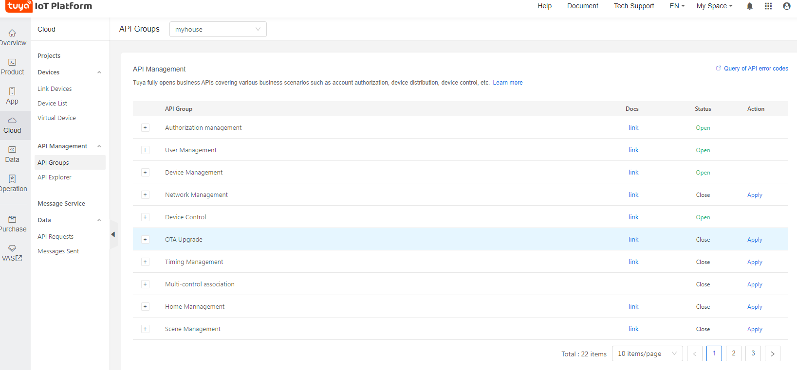

# Domoticz-Tuya
Utilisation des API tuya pour intégration dans DOMOTICZ

## Comment ça marche ?
### Step 1 - Obtenir des clés et lié son compte

1. Créez un compte sur ce site https://developer.tuya.com/en/cloud-development 

2. Enregistrez vos prises dans l'application via votre téléphone  ([Android](https://play.google.com/store/apps/details?id=com.tuya.smart&hl=fr) or [IOS](https://apps.apple.com/fr/app/tuyasmart/id1034649547)). 
3. Une fois le compte validé, cliquez sur "**Cloud Development**" dans la barre en haut puis cliquez sur  "**CreateSAASApplication**". 

Créer votre application en cliquant sur le bouton **Create**

Après avoir créé l'application cliquez dessus pour obtenir vos clés.

4. Dans le menu de gauche cliquez sur "**Linked Devices**". Sélectionnez l'onglet "**Link devices by App Account**". 
Sur votre téléphone allez dans  "**Profil**" cliquez sur l’icône  "**Scan**". 
Dans la page web cliquez sur  "**Add App Account**" and scannez le QR code. Votre compte est maintenant lié "_Tuya Cloud_".
5. Dans le menu API Group activer les composants suivants (**Open**)

### Step 2 - Configuration du scritp
Dans le dossier du script vous trouverez `code.json`. Modifiez le avec les informations Client ID et Client Secret ainsi que les prises nécessaires.

`{
   "client_id":"",
   "app_id":""
}`

### Step 3 - Fonctionnement du script
Ce script envoi des requêtes au Cloud Tuya pour envoyer des commandes aux prises. 
Il vous faut récupérer les ID des prises dans le cloud Tuya

1. Allez dans le menu **DeviceList** puis selectionnez le serveur Europe si vous êtes en Europe

Les ids sont dans la premiere colonne Device Name/ID

example : Remplacer b32d445f334D33 par ton deviceID  
`python3 main.py --switch b32d445f334D33`

`Options available
main.py --switch <ID> <True|False>
main.py --status <ID>
main.py --toggle <ID>`

## Installation du script

Dans votre dossier de scripts Domoticz clonez le repo. 

exemple pour rasberry pi : `cd /pi/home/domoticz/script/python/`

`git clone https://github.com/Canard64/Domoticz-Tuya.git `

Veuillez changer la ligne `self.full_path` en fonction du chemin où vous avez mis vos sources

Ajoutez le mode éxecutable au fichier main.py.
`chmod a+x main.py`

## Integration dans DOMOTICZ

Dans Domoticz créez un dummy device de type Switch.

Allez dans le menu Swich 

Puis modifier les caractéristiques de la prise.
On action : 
`script:///home/pi/domoticz/scripts/python/domoticz-tuya/main.py --switch DEVICEID true`

Off action : 
`script:///home/pi/domoticz/scripts/python/domoticz-tuya/main.py --switch DEVICEID false`

